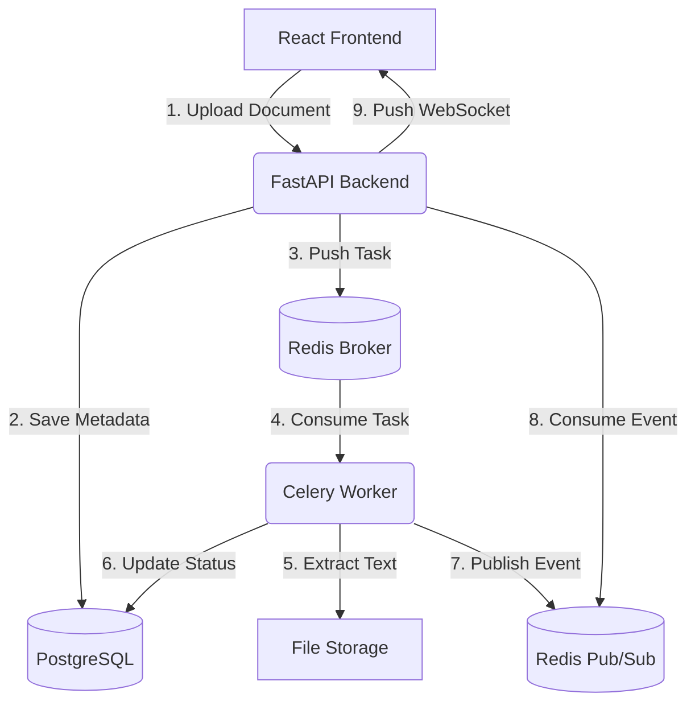

# Async Document Processing Workflow System (ADPWS)

## 🔹 Project Overview
This project is a production-grade, full-stack asynchronous document processing pipeline. It allows users to upload documents (e.g., PDFs) via a modern React frontend. The backend FastAPI server securely stores the file and delegates the heavy text-extraction and parsing operations to a background Celery worker using a Redis message broker. Real-time progress updates are broadcasted back to the frontend via WebSockets or polling fallbacks, resulting in a smooth, non-blocking user experience. Finally, users can review, edit, finalize, and export the extracted data into clean CSV or JSON formats.

**Repository:** [https://github.com/MallikarjunPatil24/Async-Document-Processing-Workflow.git](https://github.com/MallikarjunPatil24/Async-Document-Processing-Workflow.git)

## 🔹 Architecture Overview



## 🔹 Tech Stack
- **Frontend**: React, Vite, TypeScript, Lucide Icons
- **Backend**: Python 3.11, FastAPI, SQLAlchemy
- **Async Queue & Workers**: Celery
- **Message Broker & Pub/Sub**: Redis
- **Database**: PostgreSQL
- **PDF Extraction**: PyPDF2

## 🔹 Setup Instructions & Run Steps

### Option A: Docker Compose (Recommended)
The easiest way to run the entire stack is via Docker Compose, which spins up the database, broker, backend API, worker, and frontend.

1. **Clone the repository** and navigate to the project root:
   ```bash
   git clone https://github.com/MallikarjunPatil24/Async-Document-Processing-Workflow.git
   cd Async-Document-Processing-Workflow
   ```
2. **Build and start the containers**:
   ```bash
   docker-compose up --build -d
   ```
3. **Access the application**:
   - Frontend UI: `http://localhost:5173`
   - Backend API Docs: `http://localhost:8001/docs`

### Option B: Running Locally (Native/Windows)
If you prefer running without Docker:
1. Ensure PostgreSQL is running on port 5432 and Redis on 6379.
2. Setup the backend Python environment:
   ```bash
   cd backend
   python -m venv venv
   source venv/bin/activate  # or venv\Scripts\activate on Windows
   pip install -r requirements.txt
   uvicorn app.main:app --host 0.0.0.0 --port 8001
   ```
3. Start the Celery Worker (in a new terminal):
   ```bash
   cd backend
   celery -A app.worker.celery_app worker --loglevel=info --pool=solo
   ```
4. Start the Frontend:
   ```bash
   cd frontend
   npm install
   npm run dev
   ```

## 🔹 API Endpoints
| Method | Endpoint | Description |
|--------|----------|-------------|
| `POST` | `/api/upload` | Upload a new document and queue for processing |
| `GET` | `/api/documents` | Fetch all documents |
| `GET` | `/api/documents/{id}` | Fetch a single document by ID |
| `PUT` | `/api/documents/{id}` | Update extracted JSON data |
| `DELETE` | `/api/documents/{id}` | Delete a document and its file from storage |
| `POST` | `/api/retry/{id}` | Re-queue a failed or completed document |
| `POST` | `/api/finalize/{id}` | Mark document as finalized (locks editing) |
| `GET` | `/api/export/csv` | Batch export all finalized documents to CSV |
| `GET` | `/api/export/csv/{id}` | Export a single finalized document to CSV |
| `GET` | `/api/export/json/{id}` | Export a single finalized document to JSON |
| `WS` | `/ws/updates` | WebSocket endpoint for real-time progress events |

## Demo video link - [https://www.loom.com/share/c0eb04fcdde646d685eca3f0b958f5be]
## sample doc link for testing -[https://drive.google.com/file/d/1Uv-Bc7ZYlPjZ_GIiv-0OQ2omkbs-RKv2/view?usp=drive_link]

## 🔹 Assumptions
1. **Document Format**: The system assumes uploaded files are predominantly PDFs for text extraction. Non-PDFs are accepted by the pipeline but will fallback to mocked text extraction.
2. **Concurrency**: The worker is configured to use a ThreadPoolExecutor inside the Celery task to parallelize page extraction. It assumes the host machine has multiple cores available for thread-based parallelism.
3. **Pseudo-Authentication**: Since no strict auth is implemented, the frontend isolates sessions by generating and passing a UUID `X-Session-ID` to simulate multi-tenant user isolation.

## 🔹 Tradeoffs
1. **PyPDF2 vs Heavy OCR**: I chose PyPDF2 for text extraction because it is lightweight, fast, and does not require complex system dependencies like Tesseract. The tradeoff is that it cannot extract text from image-based scans.
2. **Long-polling vs WebSockets**: WebSockets are used for real-time updates as they provide the best UX. However, a setInterval-based polling fallback was explicitly added to ensure state consistency just in case the WS connection drops or misses an initial rapid event sequence.
3. **File Storage vs Cloud S3**: Files are stored locally to keep the deployment simple and testable via Docker. A `BaseStorageService` abstraction was built so replacing it with an S3 implementation later requires no architectural changes.

## 🔹 Limitations
1. **No Real User Authentication**: While `X-Session-ID` isolates data per browser, a real implementation would require a dedicated `Users` table and JWT validation middleware.
2. **Task Cancellation**: While documents can be safely deleted and re-queued, there is currently no hard-interrupt `/cancel` endpoint to kill a Celery worker mid-extraction if a massive 10,000-page file is uploaded.

## 🔹 AI Usage Disclosure
*Please note that AI-assisted development tools were utilized during the creation of this project to accelerate boilerplate generation, assist with CSS styling, and troubleshoot minor bugs. All core architectural decisions, workflow designs, and system integrations were driven by human intention and verified manually.*

## Screenshots


